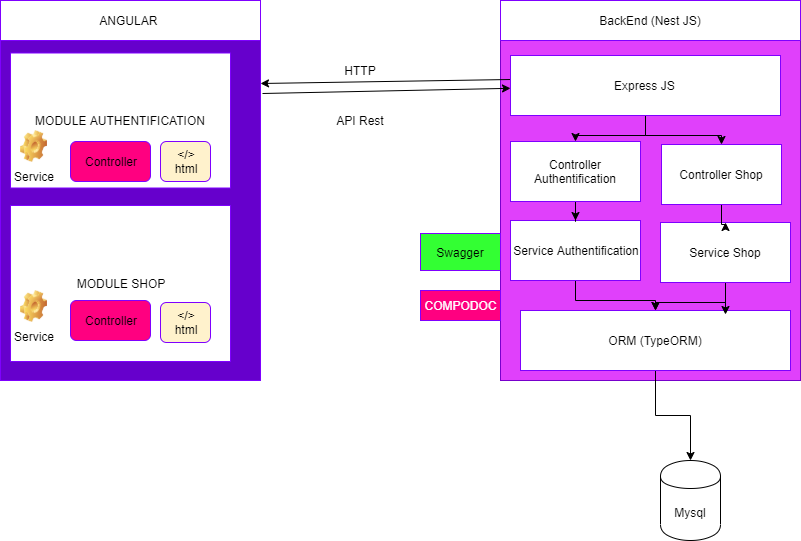

# Architecture With Nest js  & Angular 


## Description

---------------
The coding challenge is about implementing an app that lists shops nearby. 

- As a User, I can sign up using my email & password
- As a User, I can sign in using my email & password
- As a User, I can display the list of shops sorted by distance
- As a User, I can like a shop, so it can be added to my preferred shops
  - Acceptance criteria: liked shops shouldn’t be displayed on the main page


- As a User, I can dislike a shop, so it won’t be displayed within “Nearby Shops” list during the next 2 hours
- As a User, I can display the list of preferred shops
- As a User, I can remove a shop from my preferred shops list

# BackEnd 

## Requirements 
You'll simply need to install the associated client API libraries for your selected database.
 ````
  TypeOrmModule.forRoot({
      type: 'mysql',
      host: 'localhost',
      port: 3306,
      username: 'root',
      password: 'root',
      database: 'test',
      entities: [],
      synchronize: true,
    }),
 ````

## Installation

```bash
$ cd backend 
$ npm install
```

## Running the app


### development
```bash
$ npm run start
```


### watch mode
```bash
$ npm run start:dev


```
# Frontend

This project was generated with [Angular CLI](https://github.com/angular/angular-cli) version 7.0.3.
## Installation

```bash
$ cd frontend 
$ npm install
```

## Development server

Run `ng serve` for a dev server. Navigate to `http://localhost:4200/`. The app will automatically reload if you change any of the source files.


## Build

Run `ng build` to build the project. The build artifacts will be stored in the `dist/` directory. Use the `--prod` flag for a production build.


